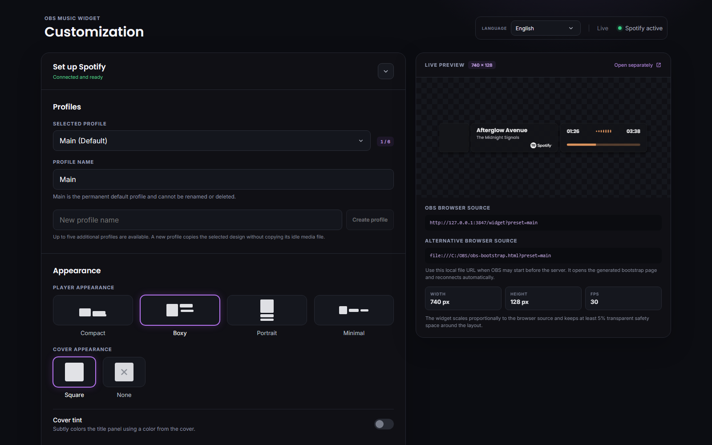
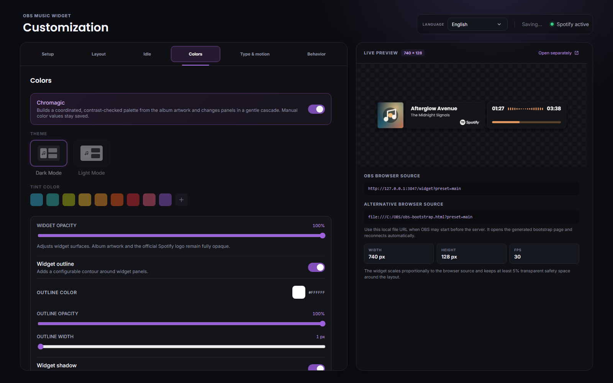
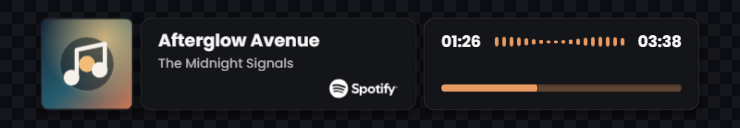
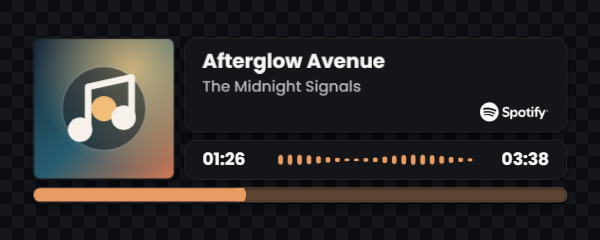
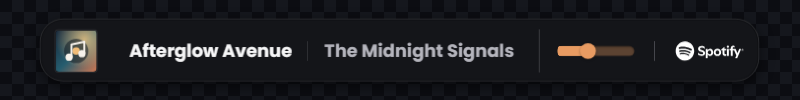
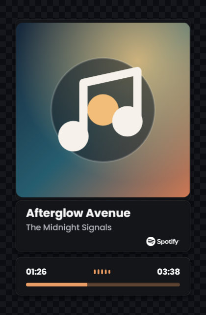
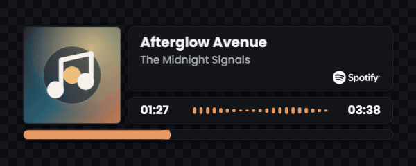
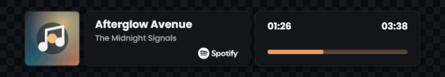

# OBS Music Widget

A local Spotify now-playing widget for OBS Studio. It comes with a browser dashboard, updates open OBS sources immediately, and can be started or stopped by Streamer.bot without opening a console window.

## Table of Contents

- [Features](#features)
- [Preview](#preview)
- [Architecture](#architecture)
- [Requirements](#requirements)
- [Installation](#installation)
- [Starting and Stopping](#starting-and-stopping)
- [Spotify Setup](#spotify-setup)
- [Dashboard](#dashboard)
- [Localization](#localization)
- [Fonts](#fonts)
- [OBS Studio Setup](#obs-studio-setup)
- [Streamer.bot Setup](#streamerbot-setup)
- [Configuration and Local Data](#configuration-and-local-data)
- [Security and Privacy](#security-and-privacy)
- [Spotify Attribution and Content Rules](#spotify-attribution-and-content-rules)
- [Development](#development)
- [Available Commands](#available-commands)
- [Local HTTP API](#local-http-api)
- [Testing](#testing)
- [Troubleshooting](#troubleshooting)
- [Known Limitations](#known-limitations)
- [Project Structure](#project-structure)
- [License and Third-Party Assets](#license-and-third-party-assets)

## Features

- Local Node.js server; no hosted backend or database
- Spotify Authorization Code flow with PKCE; no Client Secret
- JSON settings and DPAPI-protected Spotify tokens
- Live OBS updates over WebSockets without refreshing the browser source
- Main plus up to five additional scene profiles, each with independent layout and idle settings
- Boxy, Compact, Portrait, and Minimal layouts with themes, colors, visibility rules, and animations
- Per-profile text color, configurable text shadow, automatic contrast, and automatic or custom progress-track color
- Bundled Inter and Poppins fonts, plus optional Google Fonts loaded on demand
- Smooth overflow scrolling for long titles and artist names
- Stable locally interpolated progress that ignores small backward polling drift while preserving deliberate seeks
- In-memory cover cache, served locally to OBS
- Configurable idle title, artist, local media, dimming, and in-memory last-track display
- English and German dashboard translations with browser-language detection
- Silent Streamer.bot start and stop commands
- Local OBS bootstrap page for scenes that load before the server

## Preview

The examples below use fictional metadata and an original locally generated cover. No listening history, account information, or third-party album artwork is included.

### Dashboard





### Layouts

| Boxy | Compact |
|---|---|
|  |  |

| Minimal | Portrait |
|---|---|
|  |  |

The checkerboard is a documentation preview background. The OBS widget itself remains transparent.

### Motion

| Cover reflow | Visibility animation |
|---|---|
|  |  |

## Architecture

```text
Spotify Accounts + Web API
           │
           │ OAuth 2.0 PKCE and playback polling
           ▼
Local Node.js / Fastify server on 127.0.0.1:3847
├── JSON configuration
├── DPAPI-protected Spotify tokens
├── in-memory cover cache
├── HTTP API
├── WebSocket updates
├── React dashboard
└── Preact OBS widget
           │
           ├── Dashboard browser
           └── OBS browser source
```

The server binds only to `127.0.0.1`. It is not exposed to the local network.

## Requirements

- Windows 10 or Windows 11
- Node.js 22
- npm
- OBS Studio with browser source support
- Spotify Premium for Spotify Web API development-mode usage
- A Spotify Developer application
- Streamer.bot only if event-based background startup and shutdown are desired

Internet access is required for Spotify authorization, Spotify playback metadata, album covers, and optional Google Fonts. The dashboard and widget application files themselves are served locally.

## Installation

Clone or download the repository, open PowerShell in the project directory, and run:

```powershell
npm ci
npm run build
```

The production dashboard and widget are generated in `dist/`. The compiled Node.js server is generated in `build/`.

## Starting and Stopping

Start the server in a terminal:

```powershell
npm start
```

Stop the running instance from a second terminal:

```powershell
npm stop
```

Check whether an instance is running:

```powershell
npm status
```

Only one server instance may run at a time. A runtime file prevents accidental duplicate instances.

Once started, the following URLs are available:

- Dashboard: `http://127.0.0.1:3847/dashboard`
- Main widget: `http://127.0.0.1:3847/widget?preset=main`
- Health check: `http://127.0.0.1:3847/api/health`

## Spotify Setup

### 1. Create a Spotify application

Open the [Spotify Developer Dashboard](https://developer.spotify.com/dashboard), sign in, and create an application. Select **Web API** when Spotify asks which API the application will use.

### 2. Register the redirect URI

Open the Spotify application's settings and add this exact redirect URI:

```text
http://127.0.0.1:3847/api/auth/callback
```

Click **Add**, then save the application settings.

The URI has to match exactly:

- Use `http`, not `https`.
- Use `127.0.0.1`, not `localhost`.
- Use port `3847`.
- Do not add a trailing slash.
- The Client ID and redirect URI must belong to the same Spotify application.

### 3. Development-mode access

Spotify applications begin in development mode. The application owner must have Spotify Premium. Additional users must be added to the application's user allowlist in the Spotify Developer Dashboard.

### 4. Connect the widget

1. Start the local server.
2. Open `http://127.0.0.1:3847/dashboard`.
3. Paste the Spotify Client ID into the guided Spotify setup section.
4. Select **Connect with Spotify**.
5. Complete the authorization on Spotify's website.

Do not enter or share the Spotify Client Secret. This desktop/local application uses PKCE and does not need it.

The requested Spotify scope is:

```text
user-read-currently-playing
```

## Dashboard

The dashboard saves changes automatically and broadcasts them to every connected widget instance.

The Spotify setup guide opens automatically while authorization is still required. After a successful connection it starts collapsed, shows a ready status, and can be expanded manually at any time.

You can change:

- Boxy, Compact, Portrait, and Minimal layouts
- Square cover and no-cover appearance modes
- Cover-derived static title-box glow
- Dark and light themes
- Preset accent colors and a custom color picker
- Per-profile text color and shadow controls, optional automatic readability, and an unfilled progress-track color derived from the accent or explicitly overridden
- Independent metadata/progress entrance and exit animations: None, Fade, and four restrained Slide directions. Existing Grow, Shrink, Swing, and Tilt settings migrate to their closest Fade or Slide equivalent. Spotify artwork itself remains static.
- Local and optional Google fonts
- Hide on pause
- Song-change-only visibility
- Decorative playback visualizer
- Idle title and artist text, optional local GIF/WebP/WebM/PNG/JPEG media, non-destructive crop controls, and adjustable dimming
- Optional last-track mode that keeps the most recent title, artist, cover, and progress in memory while Spotify is idle; custom idle fields remain stored but disabled in the dashboard

### Profiles

The built-in `main` profile is always present and acts as the default. It cannot be renamed or deleted. Up to five additional profiles can be created, renamed, selected, and deleted in the dashboard. A new profile copies the currently selected design but starts without a copied idle media file.

Each OBS scene can select its profile through the `preset` query parameter while using the same local server process:

```text
http://127.0.0.1:3847/widget?preset=main
http://127.0.0.1:3847/widget?preset=starting-soon
http://127.0.0.1:3847/widget?preset=gameplay
```

Profile IDs remain stable when their display names change, so existing OBS source URLs do not need to be updated. Deleting a profile also deletes its locally stored idle media. The former `/widget/<profile>` route remains available for compatibility.

The live preview uses the real widget page inside a scaled OBS-sized viewport. It preserves the correct aspect ratio and does not crop shadows or transitions.

## Localization

The dashboard includes English and German translations. With the default `auto` setting, it uses the browser's preferred language and falls back to English for languages that are not currently included.

Use the language selector in the dashboard header to choose **Browser language**, **Deutsch**, or **English**. The selection is applied immediately and saved as the root-level `language` property in `.data/config.json`:

```json
{
  "language": "auto"
}
```

Valid values are `auto`, `de`, and `en`. Translation files are stored in `src/client/dashboard/locales/`. To add another language, add a JSON file with the same keys as `en.json`, register it in `src/client/dashboard/i18n.ts`, and extend the shared language schema and selector.

## Fonts

### Local fonts

Inter and Poppins are bundled as local WOFF2 assets. They work without contacting Google. The system sans-serif font is also available.

### Optional Google Fonts

No Google API key is required.

To use another Google Font:

1. Open [Google Fonts](https://fonts.google.com/).
2. Select a font family.
3. Copy the URL from the browser address bar.
4. Paste the URL into the font section in the dashboard.
5. Select **Use font**.

Supported input examples:

```text
https://fonts.google.com/specimen/Roboto+Slab
https://fonts.googleapis.com/css2?family=Roboto+Slab&display=swap
```

The dashboard extracts and stores only the family name. When a Google Font is active, the OBS browser source requests its stylesheet from `fonts.googleapis.com` and the font data from `fonts.gstatic.com`. The files are not downloaded into or redistributed with this project.

If Google Fonts is unavailable, the widget falls back to the system sans-serif font.

## OBS Studio Setup

Add a new **Browser** source and use:

```text
http://127.0.0.1:3847/widget?preset=main
```

Recommended source dimensions:

| Layout | Width | Height | FPS |
|---|---:|---:|---:|
| Boxy | 740 px | 128 px | 30 |
| Compact | 600 px | 200 px | 30 |
| Minimal | 800 px | 100 px | 30 |
| Portrait with square cover | 420 px | 640 px | 30 |
| Portrait without cover | 420 px | 244 px | 30 |

Layout design sizes and recommended OBS source dimensions are defined centrally in `src/shared/layout-dimensions.ts`.

The widget scales proportionally when the OBS browser source uses a different size. Minimal is the exception: its height controls the scale while the row expands to the full available safe width, giving additional horizontal space primarily to title and artist. Every layout reserves at least 5% transparent safety space on every side so that shadows and entrance or exit animations are not clipped. Hiding the cover uses native CSS grid and spacing transitions so the remaining panels fill the available space smoothly. When the cover is enabled again, its empty slot expands first and the unmodified artwork is inserted only at its final size. The dimensions above preserve the intended proportions and remain the recommended settings.

Minimal is a single-line layout with an optional square cover, equally sized title and artist text, a compact progress bar, and Spotify attribution at the far right. It intentionally omits time labels and the decorative visualizer. Hiding the cover gives the metadata the released space. Its rendered height is capped at the size used within a 70 px source. The recommended 100 px source adds transparent vertical room for shadows and transitions instead of enlarging the row.

Recommended OBS browser-source settings:

- Use the exact width and height shown in the dashboard for the selected layout.
- Use 30 FPS.
- Leave custom CSS empty unless a deliberate override is required.
- Keep **Refresh browser when scene becomes active** disabled for uninterrupted state.
- Decide whether to enable **Shutdown source when not visible** based on the scene setup. When enabled, the source reconnects after it becomes visible again.

### Starting OBS before the server

If OBS may load the source before the Node.js server starts, enable **Local file** in the OBS browser source and select:

```text
<project-directory>\dist\obs-bootstrap.html
```

`<project-directory>` means the folder containing this repository's `package.json`, for example `C:\Path\To\MusicWidget`. Use the absolute path shown by Windows Explorer rather than entering the placeholder literally.

The dashboard also displays the equivalent `file:///.../dist/obs-bootstrap.html` address as the alternative browser source.
For additional profiles, the displayed local-file URL includes the same query selection, for example `file:///.../dist/obs-bootstrap.html?preset=gameplay`.

The bootstrap page stays transparent while its initial health check is pending. It displays the localized startup notice only after the local server has actually failed the check and retries every three seconds. As soon as the health check succeeds, it navigates the browser source to the widget as its top-level document. The widget also waits for its initial configuration and playback state before rendering, then uses the selected entrance animation. This avoids stale offline notices and visible first-frame flashes when OBS activates a browser source. The top-level navigation preserves OBS transparency and avoids the opaque Chromium surface that can occur when an HTTP widget is embedded in a local-file iframe. If the server stops later, the loaded widget confirms that the health endpoint is unavailable before displaying the localized connection notice and continues reconnecting without resetting the OBS source.

When the server is running, the widget and dashboard distinguish between Spotify authorization, connection checks, inactive playback, expired authorization, rate limiting, and API/network errors. Expired authorization opens the Spotify setup section and prompts the user to reconnect.

## Streamer.bot Setup

Use **Core → System → Run a Program** for both actions.

### Start action

```text
Command:
C:\Windows\System32\wscript.exe

Working Directory:
<project-directory>

Arguments:
"scripts\music-widget-background.vbs" start

Wait for Exit:
0
```

### Stop action

```text
Command:
C:\Windows\System32\wscript.exe

Working Directory:
<project-directory>

Arguments:
"scripts\music-widget-background.vbs" stop

Wait for Exit:
5
```

Replace `<project-directory>` with the absolute path to the folder containing this repository's `package.json`; do not enter the angle brackets or placeholder text in Streamer.bot. For example, if the project was extracted to `C:\Tools\MusicWidget`, use that folder as the working directory.

`C:\Windows\System32\wscript.exe` is the usual command path. If Windows is installed on another drive, select `wscript.exe` from that installation's `System32` folder (equivalent to `%SystemRoot%\System32\wscript.exe`).

The VBS launcher locates Node.js through the standard installation directory or the Windows `PATH`. It starts Node.js with window style `0`, so no CMD, PowerShell, or Node console window is displayed.

The recommended trigger order is:

1. Start the music widget server.
2. Start streaming or activate the scene.
3. Stop streaming.
4. Stop the music widget server.

## Configuration and Local Data

Runtime data is stored in `.data/` and is excluded from Git.

| File | Purpose |
|---|---|
| `.data/config.json` | Versioned widget settings and presets |
| `.data/spotify.tokens` | DPAPI-protected Spotify access and refresh token data |
| `.data/runtime.json` | PID, port, startup time, and random local shutdown token |
| `.data/empty-state-media/` | Per-preset idle images or videos and validated media descriptors |

Configuration writes are validated with Zod and performed through a temporary file followed by an atomic rename.
If an existing configuration cannot be parsed or validated, it is preserved as a timestamped `config.json.invalid-*.json` file before defaults are restored.

The current album cover is cached only in server memory. It is discarded when the process stops and replaced when the source URL changes.

Idle media is limited to 20 MB and validated from its file signature before storage. Crop, focus, and zoom settings are visual CSS operations, so animated GIF, WebP, and WebM files do not need conversion. Last-track metadata and progress are retained only in server memory and are cleared when Spotify is disconnected or the server restarts.

## Security and Privacy

- The HTTP server listens only on `127.0.0.1`.
- The Spotify Client Secret is never requested or stored.
- Spotify OAuth uses Authorization Code with PKCE and a random state value.
- Spotify tokens are encrypted with Windows DPAPI for the current Windows user. Token storage fails closed rather than falling back to plaintext if DPAPI is unavailable.
- Access tokens remain in server memory and are refreshed automatically.
- Configuration changes, authorization actions, and WebSocket connections reject untrusted browser origins.
- The local shutdown endpoint requires a random token stored in `.data/runtime.json`.
- Spotify credentials are never exposed to the OBS widget URL.
- Google Fonts is optional and disabled unless a user selects one.
- No analytics, telemetry, advertising, or remote application backend is included.

Expected external hosts:

| Host | Reason |
|---|---|
| `accounts.spotify.com` | Spotify authorization and token refresh |
| `api.spotify.com` | Current playback metadata |
| `i.scdn.co` and Spotify-controlled `*.spotifycdn.com` hosts | Current album artwork, fetched once by the local server |
| `open.spotify.com` | User-initiated link from the Spotify attribution |
| `fonts.google.com` | User-initiated font browsing |
| `fonts.googleapis.com` | Optional selected Google Font stylesheet |
| `fonts.gstatic.com` | Optional selected Google Font file |

## Spotify Attribution and Content Rules

The widget uses official local Spotify logo assets for attribution. When Spotify metadata is visible, the logo links to the current item on Spotify.

The album artwork is displayed without cropping, overlays, animation, distortion, or blur. Its corners use Spotify's permitted radius. The bundled full Spotify logo is rendered at exactly 70 CSS pixels wide in every layout and compensates for widget scaling so it does not grow or shrink with the surrounding interface. Its aspect ratio, monochrome colorway, and full opacity remain unchanged. Reserved attribution spacing keeps it visually separate from artist metadata, including in the single-line Minimal layout. The optional cover glow extracts a representative color and applies it to the metadata panel; it does not modify the artwork itself.

Before using, distributing, or monetizing the widget, check Spotify's current [Developer Policy](https://developer.spotify.com/policy) and [Design and Branding Guidelines](https://developer.spotify.com/documentation/design). Spotify currently prohibits broadcasting Spotify content and synchronizing Spotify sound recordings with visual media. This project reads and displays metadata only; it does not capture or transmit Spotify audio. Do not include Spotify audio in a stream or use this project to circumvent those restrictions.

## Development

Start the backend and Vite development server together:

```powershell
npm run dev
```

Development endpoints:

- Vite dashboard: `http://127.0.0.1:5173/dashboard.html`
- Vite widget: `http://127.0.0.1:5173/widget.html?preset=main`
- Backend API and WebSocket: `http://127.0.0.1:3847`

Vite proxies `/api` and `/ws` to the backend during development.

To regenerate the neutral README screenshots and animations, run `npm run build` followed by `npm run docs:capture`. The capture tool uses local Microsoft Edge and FFmpeg, injects fictional playback data in the capture browser only, and writes the generated files to `docs/images/`. When the normal local server is not running, the tool starts and stops an isolated temporary server without reading `.data/`.

## Available Commands

| Command | Description |
|---|---|
| `npm run dev` | Start backend and Vite in watch mode |
| `npm run dev:server` | Start only the TypeScript backend watcher |
| `npm run dev:web` | Start only Vite |
| `npm run typecheck` | Type-check browser and server code |
| `npm run build` | Type-check and create production browser/server builds |
| `npm start` | Start the compiled local server |
| `npm stop` | Stop the running local server |
| `npm status` | Report whether the local server is running |
| `npm test` | Build the project and run focused unit and lifecycle smoke tests |
| `npm run test:unit` | Run focused configuration, PKCE, Spotify normalization, URL, and DPAPI tests |
| `npm run test:smoke` | Run only the compiled lifecycle smoke test |
| `npm run docs:capture` | Regenerate neutral README screenshots and short GIF demonstrations |

## Local HTTP API

| Method | Route | Purpose |
|---|---|---|
| `GET` | `/api/health` | Server, PID, uptime, and Spotify connection health |
| `GET` | `/api/config` | Current validated configuration |
| `PUT` | `/api/config` | Replace the validated configuration |
| `GET` | `/api/system/bootstrap` | Local file URL for the generated OBS bootstrap page |
| `GET` | `/api/playback` | Current normalized playback snapshot |
| `GET` | `/api/cover/current` | Current cover from the in-memory local cache |
| `GET` | `/api/empty-state-media/:preset` | Read the validated local idle media for a preset |
| `PUT` | `/api/empty-state-media/:preset` | Store GIF, WebP, WebM, PNG, or JPEG idle media up to 20 MB |
| `DELETE` | `/api/empty-state-media/:preset` | Remove the local idle media for a preset |
| `GET` | `/api/auth/login` | Begin Spotify PKCE authorization |
| `GET` | `/api/auth/callback` | Complete Spotify PKCE authorization |
| `POST` | `/api/auth/disconnect` | Remove locally stored Spotify tokens |
| `POST` | `/api/system/shutdown` | Protected local process shutdown |
| WebSocket | `/ws` | Configuration and playback snapshots/updates |

The shutdown route is intended for the bundled CLI lifecycle command. It requires the random control token and should not be called manually.

## Testing

The automated test suite remains focused. Run it with:

```powershell
npm test
```

It performs:

1. TypeScript checks
2. Production dashboard and widget build
3. Server compilation
4. Configuration defaults and legacy migration
5. Google Fonts URL parsing
6. Spotify response normalization, last-playback retention, cover-host filtering, retry parsing, and PKCE parameters
7. Idle media signature validation, isolated storage, API upload, download, deletion, and browser-origin protection
8. DPAPI token round-trip without plaintext storage
9. Server startup and health endpoint validation
10. JSON configuration read/write and browser-origin protection
11. WebSocket snapshot validation
12. Profile limits, query-parameter widget routing, and profile media cleanup
13. Dashboard and widget route validation
14. Graceful shutdown validation

Spotify authorization and live playback require a real Spotify account and are not exercised by the automated smoke test.
The smoke test uses an isolated temporary data directory and a free loopback port, so it does not read or modify the normal `.data/` files or interrupt an already running widget instance.

## Troubleshooting

### Spotify reports `redirect_uri: Not matching configuration`

Verify that the Spotify application contains this exact saved value:

```text
http://127.0.0.1:3847/api/auth/callback
```

Check the protocol, IP address, port, path, trailing slash, and Client ID. Do not use `localhost`.

### The dashboard does not open

Run:

```powershell
npm status
```

If stopped, run `npm start`. If the compiled files are missing, run `npm run build` first.

### OBS shows a blank source

- Confirm that the server is running.
- Confirm the browser source URL and port.
- Use the local `<project-directory>\dist\obs-bootstrap.html` file to receive a visible server-status notice when OBS starts first.
- Confirm that the browser-source width and height match the selected layout.

### OBS says that Spotify must be reconnected

Open `http://127.0.0.1:3847/dashboard`, expand the Spotify setup section, and select **Reconnect Spotify**. The OBS source updates automatically after authorization succeeds.

### The widget is clipped

Use the source dimensions displayed in the dashboard. They include the required animation and shadow safety area.

### A Google Font does not load

- Confirm that internet access is available.
- Paste a URL for a specific font family, not a Google Fonts search-results URL.
- Supported URLs contain `/specimen/<family>` or a `family=` query parameter.
- Confirm that OBS can access `fonts.googleapis.com` and `fonts.gstatic.com`.
- Switch back to Inter or Poppins to verify that the local widget is otherwise working.

### A console window appears during Streamer.bot startup

Use `wscript.exe` and `scripts/music-widget-background.vbs`. Do not configure Streamer.bot to launch `node.exe`, `npm`, or a CMD file directly.

### The server will not stop

Run `npm status`, then `npm stop`. If the runtime file is stale, the stop command removes it. A future start can then create a new runtime file.

### Spotify stops updating

Spotify may return rate limits, lose an active playback device, or require reauthorization. The server applies retry delays automatically. Open the dashboard to inspect the connection state and reconnect if necessary.

## Known Limitations

- The project currently targets Windows because token protection and silent background launching use Windows-specific APIs.
- Spotify development-mode user and quota limits apply.
- Spotify's Developer Policy prohibits broadcasting Spotify content and synchronizing Spotify sound recordings with visual media. The widget must not be used to include Spotify audio in an OBS stream.
- Because this is an OBS overlay, publication of the metadata itself may also be subject to Spotify's broadcast and visual-media restrictions. Confirm the intended use with Spotify or qualified legal guidance; this project cannot grant content rights.
- Spotify refresh tokens eventually require user reauthorization according to Spotify's current token lifecycle.
- The visualizer is decorative; the Spotify Web API does not provide live audio amplitude data.
- Google Fonts require an internet request each time OBS needs a font that is not already in its browser cache.
- Google Fonts are accepted through a family/specimen URL rather than a built-in live catalog search.
- This project displays Spotify metadata only. It does not capture, route, or broadcast Spotify audio.

## Project Structure

```text
MusicWidget/
├── .data/                         Local ignored runtime data
├── build/                         Compiled Node.js server
├── dist/                          Production dashboard and widget
├── scripts/
│   ├── music-widget-background.vbs
│   └── smoke-test.mjs
├── src/
│   ├── client/
│   │   ├── assets/                Local Spotify attribution assets
│   │   ├── dashboard/             React interface and dashboard locale files
│   │   ├── widget/                Preact OBS widget and status locale files
│   │   └── local-fonts.css        Local font declarations
│   ├── server/                    Fastify, Spotify, config, and lifecycle code
│   └── shared/                    Shared schemas, parsers, dimensions, and message types
├── tests/                         Focused Node.js tests
├── .gitattributes                 Cross-platform text and VBS line endings
├── .gitignore                     Dependencies, builds, and private runtime data
├── AGENTS.md                      Repository guidance for coding agents
├── LICENSE                        PolyForm terms and streaming permission
├── dashboard.html
├── widget.html
├── obs-bootstrap.html
├── package.json
└── vite.config.ts
```

## License and Third-Party Assets

The project is source-available under the [PolyForm Noncommercial License 1.0.0 with an Additional Streaming Permission](LICENSE). It is not an OSI-approved open-source license because commercial use is restricted.

Streamers may use and modify the widget for their own live streams and recorded videos, including channels monetized through advertising, subscriptions, donations, tips, sponsorships, or similar creator programs. The software itself may not be sold, rented, included in a paid product or hosted service, or provided, installed, customized, or operated for another party for payment. See `LICENSE` for the complete terms.

The license covers only this project's own code and assets where the project owner can grant those rights. It does not grant rights to Spotify content, audio, artwork, metadata, trademarks, or other third-party materials. Users remain responsible for Spotify's terms, third-party rights, and applicable law.

Inter and Poppins are distributed under their respective open-source font licenses through Fontsource packages.

Spotify logos remain Spotify trademarks and are included solely for required attribution. Their use must follow Spotify's current Design and Branding Guidelines. Album artwork and metadata remain the property of their respective rights holders and are retrieved only for the active Spotify playback item.
